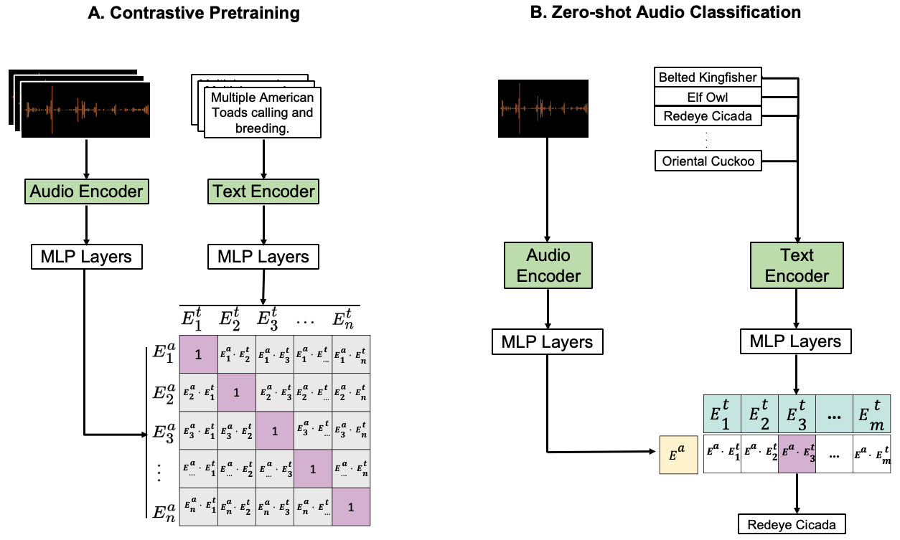

# BioLingual
## Contrastive language-audio pretraining for bioacoustics

**Paper**: Transferable Models for Bioacoustics with Human Language Supervision [arxiv link](#)

Use the model on HuggingFace! [davidrrobinson/BioLingual](https://huggingface.co/davidrrobinson/BioLingual)

BioLingual is a language-audio model for bioacoustics, useful for zero-shot audio classification and sound detection, text-to-audio search, or for fine-tuning on new bioacoustic tasks.

AnimalSpeak is a large-scale language-audio dataset used to train BioLingual, created by captioning bioacoustics archives such as Xeno-canto and iNaturalist.



To recreate the BEANS benchmarking results from the paper:

```bash
pip install -r requirements.txt
cd beans
```
Follow instructions in [beans/README.MD](./beans/README.md) to download the datasets
```bash
python run_benchmark.py
```

The AnimalSpeak dataset will be released shortly.

## Acknowledgements

We express our gratitude to the authors of [CLAP](https://github.com/LAION-AI/CLAP) and [beans](https://github.com/earthspecies/beans), which much of this repository is based on, for making their code open-source.